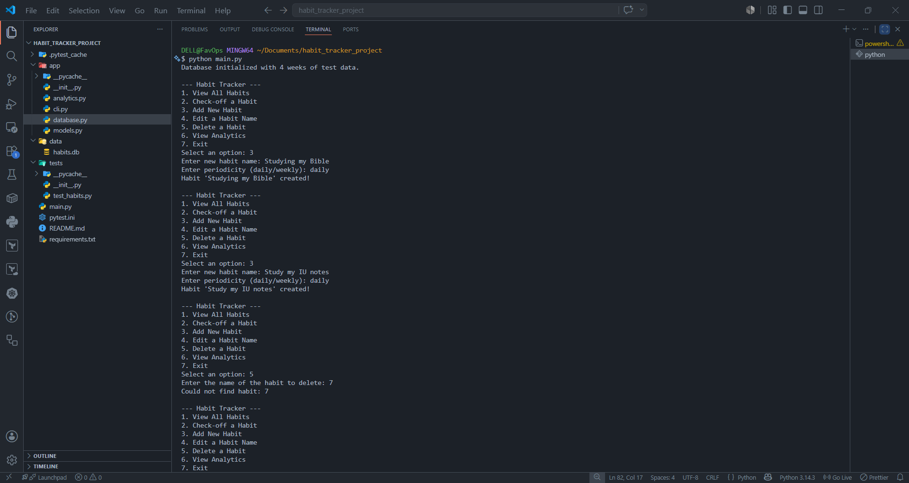
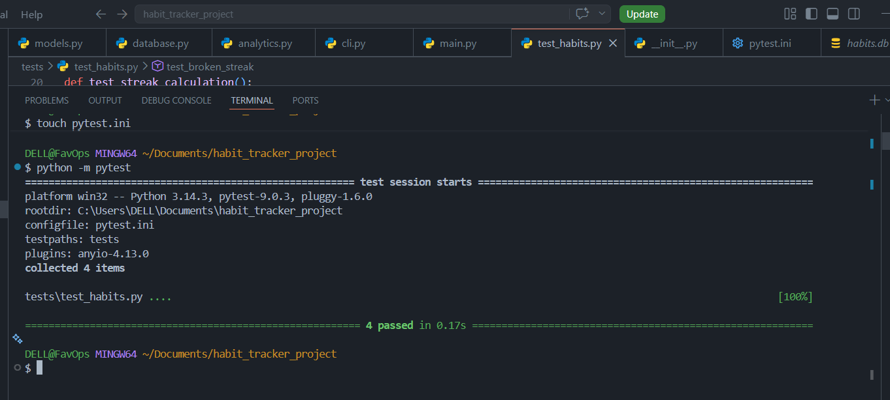
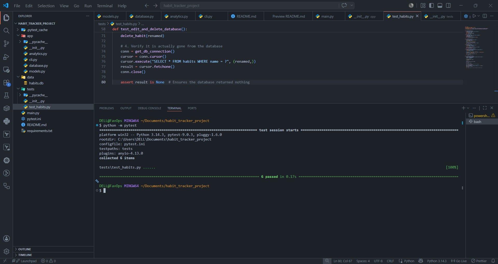

#  Habit Tracker CLI

A professional Python command-line application for tracking and analyzing daily and weekly habits. Built with a focus on modularity, data persistence, and clean architecture.

##  Overview

This application provides a robust backend solution for personal goal tracking. It utilizes **Object-Oriented Programming (OOP)** for the core habit logic and **Functional Programming (FP)** paradigms for the analytics module, ensuring that data manipulation is side-effect-free and easily testable. 

##  Key Features

* **Full CRUD Operations:** Create, read, update (rename), and delete habits seamlessly.
* **Periodicity Tracking:** Supports both `daily` and `weekly` habit definitions.
* **Automated Analytics:** Calculates current streaks and identifies the longest overall streaks using pure functions.
* **Persistent Storage:** All data and event logs are safely stored in an SQLite relational database.
* **Interactive UI:** A clean, navigable command-line interface powered by `questionary`.

##  Tech Stack
* **Language:** Python 3.7+
* **Database:** SQLite3 (Standard Library)
* **Testing:** Pytest
* **CLI:** Questionary

##  Screenshots

*(Tutor/Reviewer: See the application in action below)*

**1. Main Interactive Menu:**


**2. Verified Automated Testing:**



##  Installation

1. Clone the repository and navigate to the root directory:
   ```bash
   git clone [https://github.com/GfavourBraimah/python-habit-tracker](https://github.com/GfavourBraimah/python-habit-tracker)
   cd python-habit-tracker
   ```

2. Install the necessary dependencies:

   ```bash
     pip install -r requirements.txt
    ```
(Note: Ensure you have installed questionary and pytest)   

3. Usage
To start the application, run the entry point from your terminal:

```bash
  python main.py
```

* **Add a Habit:** Choose option 3 to define a new daily or weekly goal.
* **Check-off:** Select option 2 to log a completion timestamp for today.
* **Analytics:** Select option 6 to access the FP-driven analytics sub-menu.

4. Testing
This project utilizes pytest to verify core logic, database operations, and streak calculations. The repository includes a pre-seeded database with 4 weeks of test data for 5 predefined habits.

To run the complete test suite:

```bash
  python -m pytest
```